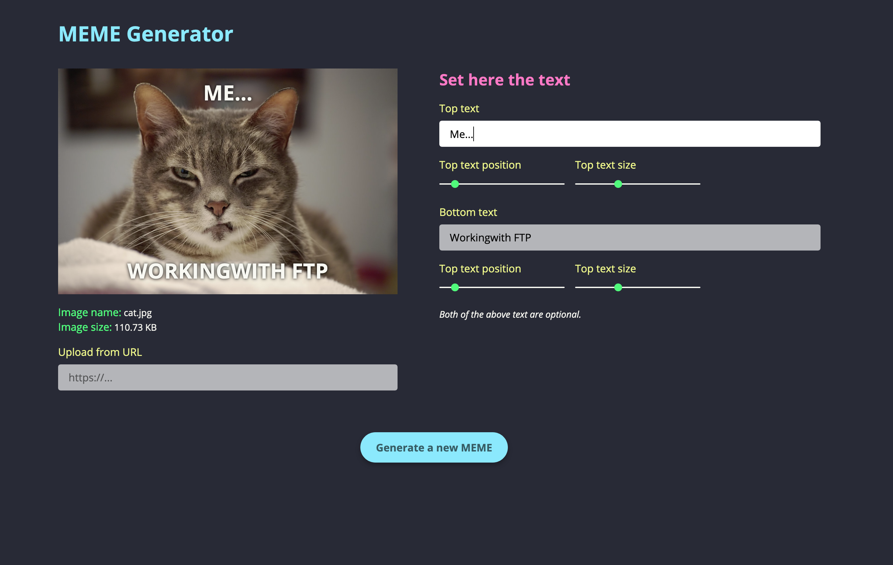

# React Meme Generator

Simple project to create custom memes. [See it live](https://pd-meme-generator.netlify.app/).

### Under the hood

- React JS
- React Context API
- React Hooks useState, useEffect, useContext, useReducer
- Styled Components
- URL interface (Web APIs)
- HTML to Image

---

Stay safe and enjoy 😉
